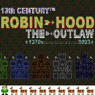
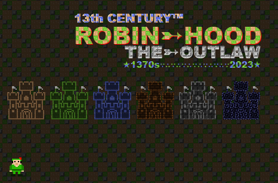
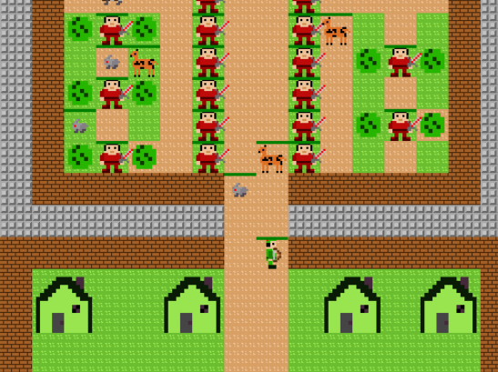
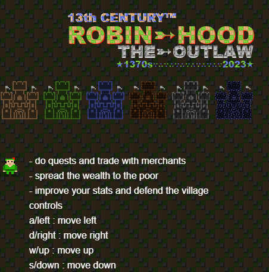
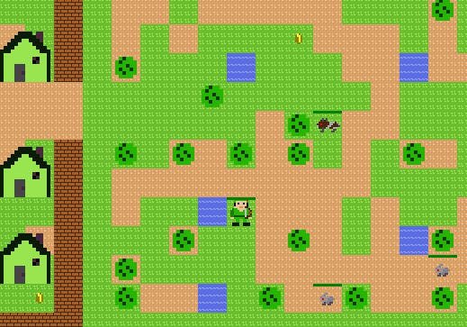
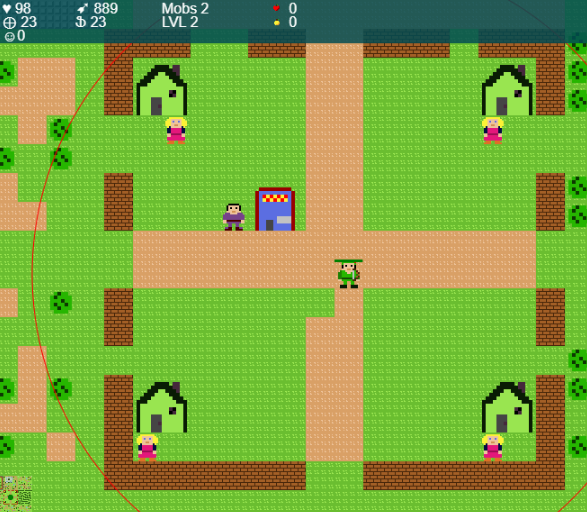

# Robin Hood : ENTRY FOR JS13K 2023 Competiton

> you step into the legendary shoes of Robin Hood.
> your mission is to make the world a better place.
> - explore forest and hunt animals
> - trade with merchants
> - take quest from villagers
> - improve your stats and defend the village
> a w s d / arrows for movement
> e interact, q menu, space shoot arrow

# Loading Scene

# Idea Origin
on the day of anouncing the theme, which I've been waiting for since last year, I got the them and went to mr chat gpt (most of us did)
anyway, clearly robin hood was mentioned and I directly went to the idea of a mutated version, robin does not steal but give
having robin known for his archery skills, I wanted a game when the mc is an archer that hunt animals and work hard to give the poor

# Sprite
I want to talk about this as ive been so invested in it, first my spritesheet have all the sprites in a very small ratio
like for tiles its 8x8 px and for player its a 16x16px and so on
improving my code to utilize magnifying sprites with keeping pixelation for the loved retro-style
> initColorMatrix that will crop the sprite from sprite sheet, remove the white bg and give a matrix of colors
> colorsMatrixToSprite that will take the matrix, apply it to a new canvas, with any magnification needed and also ability to alter colors

# Game map and entities
so using sprite manipulations I was able to from a single sprite have many possiblities to work with
add to that the skeleton functionality where the castles on loading was its poc, where I could fuse tiles with a single slelected color in sprite
this helped me alot in making variations in many parts and proud of these though I suspect there are better ways to handle sprites in other engines
as for maps i have a predefined village, castle, forest, and forest with cave as a sprite which i use matrix to replace the color with what entities should be there
map generator did most of the work as I was planning to make some more parts with mazes and dungeons but size limit and time had me to pause on them

# Gameplay
I tested the game on my laptop and things were smooth, however I kept sharing progress with others
and things was not as one would hope for, so changes had to be made
first the mobs will not move in the update everytime, but will depend on the player entity for them to take actions
so when player is within range of mob it will take action, steath skill was added to reduce the radius of that
so no need to update entities that are too far from player, reducing memory use 
as for the bears and soldires, it was intentional for now to make them spawn ridiculously infinitly
the plan was to make the castle and cave as portals to new maps but things dont go as planned 
so make plan and do plan, plan go sideway, throw away the plan >_<

# Things that was planned for but did not see light
villagers were to move and perform actions, have the village more ... villagy
instead i added 4 girl npc with random local difficulty for quests 
so one will ask for 1$ and one will ask for 10$ per apple
points were supposed to be morale when robin help people and make him level and get more powerful for advance levels
castle was to have maze in it and rooms where soldires spawn to prevent robin from reaching treasure room
cave was to have its own world, when different mobs spawn and have some new challenge 
trees was supposed to provide the food like apple and oranges instead i made trader give them to fulfil villager quest
quests was planned to be like hunt 2 rabbits or so, but for simplicity made it so trader give apples and villagers ask for them
the wizard was planned to have his own part of the forest, which was planned to be very large, and give legin magical bow
magic bow was to have arrows follow mobs around and avoid obstacles but I got lazy though its easy to do with pathfind already there

# Messed up
firefox was not loading the spritesheet well, I had to make some changes
but for some reason it caused some issues on mobile version
also due to size reduction I had to remove alot of things that were otherwise cool to have

# Sound 
as last year I got many feedback on why not add bgm and sound I have music player and some more sound
some sounds were later removed because of reducing size, like hit sound, should not have done that as someone mentioned it would enhance play
will have to research more on the audio api as it was not prefect and some entries have nice sound and music
# Next
I'm not done wtih this game but development for it has to wait as I'm working on something else and I lack motivation to push this more for now
maybe also I'll continue journy for working on 3d games

## Controls
- A / Left Arrow: Move left.
- D / Right Arrow: Move right.
- W / Up Arrow: Move up.
- S / Down Arrow: Move down.
- Space: Shoot arrow.
- E: Interact with objects and villagers.
- Q: Open the menu.
## Targets
- Hunt animals to gather resources and improve your character's abilities.
- Interact with villagers to take on quests and earn rewards.
- Harvest trees to collect apples, lemons, and more.
- Explore the forest, uncover secrets, and make the world a better place.

## Features

- Stunning pixel art visuals and immersive sound effects.
- Engaging quests and challenges that unfold Robin Hood's story.
- Upgradable skills, weapons, and equipment to enhance your character.

## Additional Challenges
- Embark on a journey to find the old wizard and acquire the legendary magic bow.
- Face off against powerful foes in the heart of the forest.
- Discover hidden locations and uncover the secrets of the world.

## Screenshots

