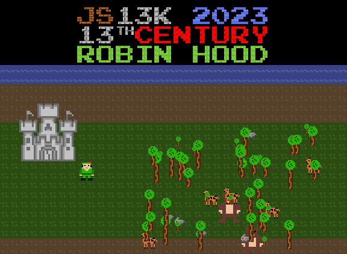

# Robin Hood's Quest: A Legendary Adventure

ENTRY FOR JS13K 2023 Competiton

Welcome to **Robin Hood's Quest: A Legendary Adventure**! 
Embark on a heroic journey as you follow in the footsteps of the legendary outlaw, Robin Hood. 
Your mission is to make the world a better place by helping villagers, exploring the forest, and spreading wealth to the poor.

## Game Overview

In **Robin Hood's Quest**, you'll:
- Explore a rich and vibrant forest teeming with wildlife.
- Complete quests and trade with merchants in the village.
- Spread your wealth to those in need, gaining the villagers' trust and admiration.
- Upgrade your character's skills and equipment to protect the village from threats.

## Gameplay

- Hunt animals to gather resources and improve your character's abilities.
- Interact with villagers to take on quests and earn rewards.
- Harvest trees to collect apples, lemons, and more.
- Explore the forest, uncover secrets, and make the world a better place.
## Controls

- A / Left Arrow: Move left
- D / Right Arrow: Move right
- W / Up Arrow: Move up
- S / Down Arrow: Move down
- Space: Shoot arrow
- E: Interact with objects and villagers
- Q: Open the menu
## Features

- Stunning pixel art visuals and immersive sound effects.
- Engaging quests and challenges that unfold Robin Hood's story.
- Upgradable skills, weapons, and equipment to enhance your character.

## Additional Challenges
- Embark on a journey to find the old wizard and acquire the legendary magic bow.
- Face off against powerful foes in the heart of the forest.
- Discover hidden locations and uncover the secrets of the world.

## Screenshots
TODO
<!--  -->
<!--  -->
<!--  -->
