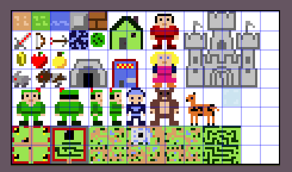

# Robin Hood : ENTRY FOR JS13K 2023 Competiton

> you step into the legendary shoes of Robin Hood.
> your mission is to make the world a better place.
> - explore forest and hunt animals
> - trade with merchants
> - take quest from villagers
> - improve your stats and defend the village
> a w s d / arrows for movement
> e interact, q menu, space shoot arrow

# Loading Scene

# Idea Origin
on the day of anouncing the theme, which I've been waiting for since last year, I got the them and went to mr chat gpt (most of us did)

anyway, clearly robin hood was mentioned and I directly went to the idea of a mutated version, robin does not steal but give

having robin known for his archery skills, I wanted a game when the mc is an archer that hunt animals and work hard to give the poor

# Sprite
I want to talk about this as ive been so invested in it, first my spritesheet have all the sprites in a very small ratio
like for tiles its 8x8 px and for player its a 16x16px and so on
improving my code to utilize magnifying sprites with keeping pixelation for the loved retro-style
> initColorMatrix that will crop the sprite from sprite sheet, remove the white bg and give a matrix of colors
> colorsMatrixToSprite that will take the matrix, apply it to a new canvas, with any magnification needed and also ability to alter colors

I did the sprites in a way that I could crop them from a single sheet

first the tiles for floor like grass, dirt, water, and i later added snow

we have the mario bricks i like to use, and the steel from retro battle city game

sword for the soldiers, bow for robin, the arrow, and so on

my code utilizes the small drawn pixel art and magnify as needed

most of my sprite manipulation techniques are aimed toward using the small input and inflate it

so i could be having whatever sprite and 100 times its origin yet have the origin size at minimum

I want to research more about how other engines use sprites, and try to have some animations added

code explained, i will show how to get sprite for castle
> getSprites(mult = 2){
>     var canvasOriginal = gf.colorsMatrixToSprite(SPRITECOLORMATRIX.castle,mult);
>     var skele = gf.getCanvasSkeleton(canvasOriginal);
>     var outerprint = gf.colorsMatrixToSprite(skele['#6a6a6a']);
>     var bodyprint = gf.colorsMatrixToSprite(skele['#c2c2c2']);
> 
>     var outer_dirt1 = gf.fuseImage(outerprint,gf.Lightify(SPRITES_1.dirt,.5));
>     var outer_grass = gf.fuseImage(outerprint,gf.Lightify(SPRITES_1.grass,.5));
>     var outer_water = gf.fuseImage(outerprint,gf.Lightify(SPRITES_1.water,.5));
>     var outer_brick = gf.fuseImage(outerprint,gf.Lightify(SPRITES_1.brick,.5));
>     var outer_steel = gf.fuseImage(outerprint,gf.Lightify(SPRITES_1.steel,.5));
>     var outer_magic = gf.fuseImage(outerprint,gf.Lightify(SPRITES_1.magic,.5));
>     
>     var body_dirt1 = gf.fuseImage(bodyprint,gf.Lightify(SPRITES_1.dirt,.2));
>     var body_grass = gf.fuseImage(bodyprint,gf.Lightify(SPRITES_1.grass,.2));
>     var body_water = gf.fuseImage(bodyprint,gf.Lightify(SPRITES_1.water,.2));
>     var body_brick = gf.fuseImage(bodyprint,gf.Lightify(SPRITES_1.brick,.2));
>     var body_steel = gf.fuseImage(bodyprint,gf.Lightify(SPRITES_1.steel,.2));
>     var body_magic = gf.fuseImage(bodyprint,gf.Lightify(SPRITES_1.magic,.2));
> 
>     this.dirt =     gf.combineSprites([canvasOriginal,body_dirt1,outer_dirt1]);
>     this.grass =    gf.combineSprites([canvasOriginal,body_grass,outer_grass]);
>     this.water =    gf.combineSprites([canvasOriginal,body_water,outer_water]);
>     this.brick =    gf.combineSprites([canvasOriginal,body_brick,outer_brick]);
>     this.steel =    gf.combineSprites([canvasOriginal,body_steel,outer_steel]);
>     this.magic =    gf.combineSprites([canvasOriginal,body_magic,outer_magic]);
> }

as for loading scene the castles were all derived from the main castle sprite

I used the getCanvasSkeleton to get skeleton of castle, then got the body and outline of it

then I fused these parts with different types of texture and added some opacity to make it standout

the results were cool sort of speaking, the other entities have a similar way of use

some parts need rotaion or mirroring , like bow when robin move sideways 

> else if(this.direction == DIRECTION.LEFT){
>     ctx.drawImage(gf.mirror(this.bow),this.center.x + this.sprite.width - this.bow.width * 1.6,this.center.y + this.sprite.height - this.bow.height * 1.3);
> }

rotation was good used like when arrow need to be heading in a direction

add to that if some sprite have size smaller than tile size and need some centering, i added a function that does that

so for arrow the code for it is as follow

> var arrow = gf.colorsMatrixToSprite(SPRITECOLORMATRIX.arrow,multiplier);
> var canvas = gf.centerCanvasOn(arrow,size,size);
> var r = gf.rotateCanvasCw(canvas,0);
> var d = gf.rotateCanvasCw(canvas,2);
> var l = gf.rotateCanvasCw(canvas,4);
> var u = gf.rotateCanvasCw(canvas,6);

since i may need diagonal rotation each step rotate the canvas 45 degrees, so each have 2 steps to reach the next rotation along xy

# Game map and entities
so using sprite manipulations I was able to from a single sprite have many possiblities to work with

add to that the skeleton functionality where the castles on loading was its poc, where I could fuse tiles with a single slelected color in sprite

this helped me alot in making variations in many parts and proud of these though I suspect there are better ways to handle sprites in other engines

as for maps i have a predefined village, castle, forest, and forest with cave as a sprite which i use matrix to replace the color with what entities should be there

map generator did most of the work as I was planning to make some more parts with mazes and dungeons but size limit and time had me to pause on them

one of the challenges was to retain having key-value maps when using google closure and roadroller

so my temp fix was to have function with switch case

> const colorToTileMap = (k)=>{
>     switch(k){
>         case '#99e550': return 'grass';
>         case '#d9a066': return 'dirt';
>         case '#dcdcdc': return 'snow';
>         case '#8a99f6': return 'water';
>     }
>     return null;
> }

using the maps in sprite sheet, taking matrix, and replacing with tiles, I was able to make custom maps on demand

expanding the map would only cost changing a few lines on the map generator class

as for the pathfind logic, ive used the map to define where trees, bricks, steel, buildings are 

so i could know if a certain tile have an obstacle for it, using the predefined mapping for each

> const MAPTILES = [
>     {'n':'p',o:1,'c':'#0d3702'},//tree
>     {'n':'p',o:1,'c':'#bf0a0a'},//brick
>     {'n':'p',o:0,'c':'#d9a066'},//dirt
>     {'n':'p',o:0,'c':'#99e550'},//grass
>     {'n':'p',o:2,'c':'#8a99f6'},//water
> ] //... etc

dirt and grass have obstacle level 0, passable by everything

brick obstacle level is 1, not passable by anything

so water have an o level of 2, which mean the bow may cross but not mobs or player

one of the glitches I found rather as feature the diagonal walk, where player can move down to left and land on an obstacle

I decided to let it happen eventually because I plan to make a use for it later

# Gameplay

I tested the game on my laptop and things were smooth, however I kept sharing progress with others

and things was not as one would hope for, so changes had to be made

first the mobs will not move in the update everytime, but will depend on the player entity for them to take actions

so when player is within range of mob it will take action, steath skill was added to reduce the radius of that

so no need to update entities that are too far from player, reducing memory use 

as for the bears and soldires, it was intentional for now to make them spawn ridiculously infinitly

the plan was to make the castle and cave as portals to new maps but things dont go as planned 

so make plan and do plan, plan go sideway, throw away the plan >_<

# Things that was planned for but did not see light

villagers were to move and perform actions, have the village more ... villagy

instead i added 4 girl npc with random local difficulty for quests 

so one will ask for 1$ and one will ask for 10$ per apple

points were supposed to be morale when robin help people and make him level and get more powerful for advance levels

castle was to have maze in it and rooms where soldires spawn to prevent robin from reaching treasure room

cave was to have its own world, when different mobs spawn and have some new challenge 

trees was supposed to provide the food like apple and oranges instead i made trader give them to fulfil villager quest

quests was planned to be like hunt 2 rabbits or so, but for simplicity made it so trader give apples and villagers ask for them

the wizard was planned to have his own part of the forest, which was planned to be very large, and give legin magical bow

magic bow was to have arrows follow mobs around and avoid obstacles but I got lazy though its easy to do with pathfind already there

# Messed up

firefox was not loading the spritesheet well, I had to make some changes

but for some reason it caused some issues on mobile version

also due to size reduction I had to remove alot of things that were otherwise cool to have

some of them was the detailed instructions, 

these were messed up thoughts to reduce size from these as I got many complaints going like I had no idea what to do

overall I think the expanded game will have a tutorial level or training ground maybe but as a separate scene and not part of main course of the game

# Sound 

since last year I got many feedback on why not add bgm and sound I have music player and some more sound

some sounds were later removed because of reducing size, like hit sound, should not have done that as someone mentioned it would enhance play

will have to research more on the audio api as it was not prefect and some entries have nice sound and music

# Next

I'm not done with this game but development for it has to wait a bit as I'm working on something else 

also I lack motivation to push this more for now, maybe if it win or get a nice position I'll have some :p

maybe also I'll continue journy for working on 3d games

## Controls
- A / Left Arrow: Move left.
- D / Right Arrow: Move right.
- W / Up Arrow: Move up.
- S / Down Arrow: Move down.
- Space: Shoot arrow.
- E: Interact with objects and villagers.
- Q: Open the menu.
## Targets
- Hunt animals to gather resources and improve your character's abilities.
- Interact with villagers to take on quests and earn rewards.
- Harvest trees to collect apples, lemons, and more.
- Explore the forest, uncover secrets, and make the world a better place.

## Features

- Stunning pixel art visuals and immersive sound effects.
- Engaging quests and challenges that unfold Robin Hood's story.
- Upgradable skills, weapons, and equipment to enhance your character.

## Additional Challenges
- Embark on a journey to find the old wizard and acquire the legendary magic bow.
- Face off against powerful foes in the heart of the forest.
- Discover hidden locations and uncover the secrets of the world.

## Screenshots

